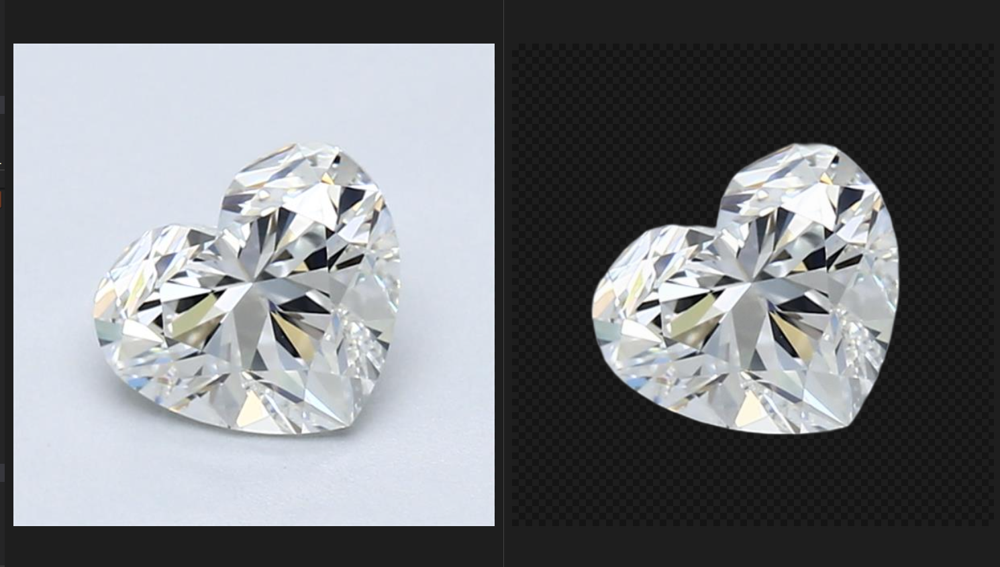
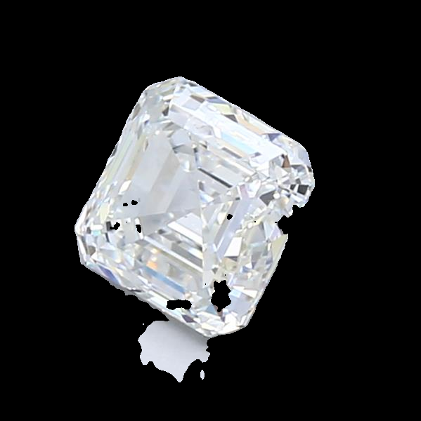

# Mined2022tech
<H2> Background Removal from image using ML techniques and image processing </H2>

Image segmentation has helped to solve a variety of difficult problems. One such problem is separating the diamond from the image. We have over 2.3 million images in our dataset that contain diamonds at various angles. The shiny reflecting cuts of the diamond, as well as the shadow beneath it, make this a difficult but fascinating problem to solve.

# In this repo two methods are described
- using deeplabv3+ model (Transfer learning)
- remgb library 

 

    <h3>REMBG Output</h3>
    
     
     
    <h3>DEEPLABV3+</h3>
    

	
